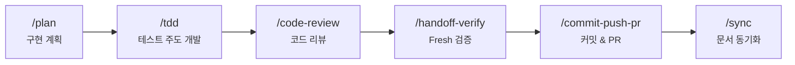

<div align="center">

# dotnet-claude-forge

**C# / .NET 10 + Blazor Auto 특화 Claude Code 개발 프레임워크**

C# / .NET 10 · Blazor Auto · Supabase · Azure 기반 프로젝트를 위한
Claude Code 설정, 커스텀 에이전트, 자동화 스크립트 모음

[](LICENSE)
[](https://claude.com/claude-code)
[](https://dotnet.microsoft.com)

> [sangrokjung/claude-forge](https://github.com/sangrokjung/claude-forge)를 포크하여 .NET 전용으로 재구성한 버전입니다.

[English](README.md)

</div>

---

## dotnet-claude-forge란?

**dotnet-claude-forge**는 [claude-forge](https://github.com/sangrokjung/claude-forge)를 **.NET 10 / Blazor Auto / Clean Architecture** 환경에 최적화한 포크입니다.

Claude Code를 기본 CLI에서 **완전한 .NET 개발 환경**으로 변환합니다. 설치 한 번으로 **11개 전문 에이전트**, **36개+ 슬래시 커맨드**, **.NET 전용 검증 스킬**(Blazor/EF/Clean Arch), **14개 자동화 훅**이 즉시 사용 가능합니다.

### 원본(claude-forge) 대비 추가된 것

| 추가 항목 | 내용 |
|:---------|:-----|
| `skills/verify-blazor` | `.razor` 컴포넌트 구조·DI·렌더모드 검증 |
| `skills/verify-ef-migration` | EF Core 마이그레이션 안전성 검사 |
| `skills/verify-clean-arch` | Clean Architecture 레이어 의존성 위반 탐지 |
| `rules/architecture-dotnet` | Clean Architecture 레이어 구조, CQRS, Result 패턴 |
| `rules/coding-style-dotnet` | Nullable, 불변성, Serilog, 파일 크기 기준 |
| `rules/security-dotnet` | JWT + HttpOnly Cookie, CORS, FluentValidation |
| `rules/testing-dotnet` | TDD 워크플로우, xUnit, Testcontainers |
| `rules/database-supabase` | PostgreSQL, EF Core, RLS, 마이그레이션 |
| `rules/frontend-blazor` | Blazor Auto, JS Interop, 메모리 관리 |
| `rules/azure-deployment` | App Service, Key Vault, Scale Out 주의사항 |

---

## ⚡ 빠른 시작

```bash
# 1. 클론
git clone --recurse-submodules https://github.com/daeha76/dotnet-claude-forge.git
cd dotnet-claude-forge

# 2. 설치 (macOS / Linux)
./install.sh

# 2. 설치 (Windows PowerShell)
.\install.ps1

# 3. Claude Code 실행
claude
```

> macOS/Linux는 심볼릭 링크로 설치되어 `git pull` 즉시 반영됩니다.
> Windows는 파일 복사 방식이므로 `git pull` 후 `install.ps1`을 다시 실행하세요.

### 처음이신가요?

| 단계 | 할 일 |
|:----:|:------|
| 1 | 설치 후 `/guide` 실행 — 3분 인터랙티브 투어 |
| 2 | `/plan` 으로 구현 계획 수립 |
| 3 | `/auto 로그인 페이지 만들기` 처럼 원버튼으로 플랜-to-PR 실행 |

---

## 🔄 개발 워크플로우

### 새 기능 개발

```
/plan → /tdd → /code-review → /handoff-verify → /commit-push-pr → /sync
```



| 단계 | 커맨드 | 설명 |
|:----:|:-------|:-----|
| 1 | `/plan` | planner 에이전트가 구현 계획, 의존성, 리스크를 분석 |
| 2 | `/tdd` | tdd-guide 에이전트가 RED→GREEN→IMPROVE 사이클 진행 |
| 3 | `/code-review` | code-reviewer 에이전트가 CRITICAL/HIGH/MEDIUM 이슈 분류 |
| 4 | `/handoff-verify` | verify-agent가 새 컨텍스트에서 `dotnet build` + `dotnet test` 검증 |
| 5 | `/commit-push-pr` | 커밋 메시지 작성, 푸시, PR 생성까지 자동화 |
| 6 | `/sync` | 프로젝트 문서 동기화 (`prompt_plan.md`, `spec.md`, `CLAUDE.md`, rules) |

### 버그 수정

```
/explore → /tdd → /verify-loop → /quick-commit → /sync
```

| 단계 | 커맨드 | 설명 |
|:----:|:-------|:-----|
| 1 | `/explore` | 코드베이스를 탐색하여 원인 파악 |
| 2 | `/tdd` | 실패 테스트 작성 → 최소 수정 → 통과 확인 |
| 3 | `/verify-loop` | 빌드·테스트를 반복 검증하며 사이드 이펙트 확인 |
| 4 | `/quick-commit` | 빠른 커밋 & 푸시 |
| 5 | `/sync` | 커밋 후 프로젝트 문서 동기화 |

### 보안 감사

```
/security-review → /stride-analysis-patterns → /security-compliance
```

| 단계 | 커맨드 | 설명 |
|:----:|:-------|:-----|
| 1 | `/security-review` | security-reviewer 에이전트가 OWASP Top 10 기반 분석 |
| 2 | `/stride-analysis-patterns` | STRIDE 위협 모델링 수행 |
| 3 | `/security-compliance` | SOC2, GDPR 등 컴플라이언스 검증 |

### 팀 협업

```
/orchestrate → Agent Teams (병렬 작업) → /commit-push-pr
```

`/orchestrate` 커맨드로 Agent Teams를 구성하여 프론트엔드·백엔드·테스트를 병렬로 개발합니다.

---

## 📦 구성 요소

| 카테고리 | 수량 | 주요 항목 |
|:--------:|:----:|:----------|
| **에이전트** | 11 | `planner` `architect` `code-reviewer` `security-reviewer` `tdd-guide` `database-reviewer` (Opus) / `build-error-resolver` `e2e-runner` `refactor-cleaner` `doc-updater` `verify-agent` (Sonnet) |
| **커맨드** | 36 | `/commit-push-pr` `/handoff-verify` `/explore` `/tdd` `/plan` `/orchestrate` `/security-review` ... |
| **스킬** | 15 | `build-system` `security-pipeline` `team-orchestrator` `session-wrap` `verification-engine` ... |
| **훅** | 14 | 보안 방어 6개 + 유틸리티 8개 |
| **규칙** | 8 | `architecture-dotnet` `coding-style-dotnet` `security-dotnet` `testing-dotnet` ... |

---

## 📥 설치 가이드

### 사전 요구사항

| 도구 | 필수 | 용도 |
|:-----|:----:|:-----|
| **.NET SDK** | ✅ | `install.csx` 실행 + .NET 프로젝트 생성 |
| **Git** | ✅ | 클론, 서브모듈 |
| **Claude Code CLI** | ✅ | `claude` 명령어 |
| **Node.js** | ✅ | MCP 서버 실행 (npx) |
| **dotnet-script** | 자동 설치 | C# 스크립트 실행 엔진 |

### .NET 신규 프로젝트 생성

```bash
# macOS / Linux
./install.sh MyApp

# Windows
.\install.ps1 MyApp

# 경로 지정 (macOS / Linux)
./install.sh MyApp ~/Desktop

# 경로 지정 (Windows)
.\install.ps1 MyApp D:\\projects
```

Clean Architecture 솔루션이 자동 생성됩니다:

```
MyApp/
  src/
    MyApp.Domain/           # 엔터티, 값 객체
    MyApp.Application/      # 유스케이스, CQRS, 인터페이스
    MyApp.Infrastructure/   # EF Core, Supabase, 외부 서비스
    MyApp.Api/              # ASP.NET Core Web API
    MyApp.Web/              # Blazor Auto 프론트엔드
    MyApp.AppHost/          # .NET Aspire 오케스트레이터
  tests/
    MyApp.Domain.Tests/
    MyApp.Application.Tests/
    MyApp.Architecture.Tests/   # 레이어 의존성 자동 검증
  .claude/                 # Claude Forge 기능
  CLAUDE.md                # 프로젝트 컨텍스트
```

### MCP 서버

| 서버 | API 키 | 설명 |
|:-----|:------:|:-----|
| **context7** | 없음 | 실시간 라이브러리 문서 조회 |
| **memory** | 없음 | 영속적 지식 그래프 |
| **github** | `GITHUB_PERSONAL_ACCESS_TOKEN` | 리포/PR/이슈 관리 |
| **supabase** | Supabase URL/Key | DB 직접 연동 |

---

## 💻 .NET 프로젝트에서 기능 개발하기

### 기능 개발 — 두 가지 방법

#### 방법 1: 원버튼 자동화 (추천)

```
/auto 이메일+비밀번호 로그인 기능. Supabase Auth 사용. JWT를 HttpOnly 쿠키로 저장.
```

`plan → tdd → code-review → handoff-verify → commit-push-pr` 파이프라인이 자동 실행됩니다.

#### 방법 2: 단계별 제어

```
/plan 로그인 기능 구현
/tdd
/handoff-verify
/commit-push-pr
```

### 실제 파일 생성 위치 예시 (로그인 기능)

```
src/
├── Domain/Users/
│   ├── User.cs                        # 엔티티
│   └── ValueObjects/Email.cs          # 이메일 값 객체
├── Application/Auth/Login/
│   ├── LoginCommand.cs                # CQRS Command
│   └── LoginCommandHandler.cs
├── Infrastructure/Auth/
│   └── SupabaseAuthService.cs
├── Api/Controllers/
│   └── AuthController.cs              # POST /api/v1/auth/login
└── Web/Pages/Auth/
    └── LoginPage.razor                # Blazor 로그인 화면

tests/
├── Application.Tests/Auth/
│   └── LoginCommandHandlerTests.cs
└── Api.Tests/Auth/
    └── AuthControllerTests.cs
```

> `rules/` 폴더에 Clean Architecture, Blazor, 보안 규칙이 정의되어 있어 별도 지시 없이도 올바른 레이어에 올바른 패턴으로 파일이 생성됩니다.

### .NET 전용 검증 커맨드

```bash
/verify-blazor          # .razor 컴포넌트 구조 검증
/verify-ef-migration    # EF Core 마이그레이션 안전성 검사
/verify-clean-arch      # Clean Architecture 레이어 위반 탐지
```

---

## 🤖 에이전트

### Opus 에이전트 (6) — 심층 분석 & 설계

| 에이전트 | 역할 |
|:---------|:-----|
| **planner** | 복잡한 기능의 구현 계획 수립, 의존성/리스크 분석 |
| **architect** | 시스템 설계, 확장성 결정, 기술 의사결정 |
| **code-reviewer** | CRITICAL/HIGH/MEDIUM 이슈 분류 코드 리뷰 |
| **security-reviewer** | OWASP Top 10, 시크릿, SQL Injection 탐지 |
| **tdd-guide** | RED → GREEN → IMPROVE 테스트 주도 개발 |
| **database-reviewer** | PostgreSQL/Supabase 스키마, 쿼리 최적화 |

### Sonnet 에이전트 (5) — 빠른 실행 & 자동화

| 에이전트 | 역할 |
|:---------|:-----|
| **build-error-resolver** | 빌드/컴파일 오류 자동 수정 |
| **e2e-runner** | E2E 테스트 생성, 실행, 관리 |
| **refactor-cleaner** | 불필요한 코드 정리 |
| **doc-updater** | 문서 및 코드맵 자동 업데이트 |
| **verify-agent** | 새 컨텍스트에서 빌드·테스트·린트 검증 |

---

## 📋 전체 커맨드 목록

<details>
<summary><strong>36개 커맨드 (클릭해서 펼치기)</strong></summary>

#### 핵심 워크플로우

| 커맨드 | 설명 |
|:-------|:-----|
| `/plan` | AI 구현 계획 수립. 승인 후 코딩 시작. |
| `/tdd` | 테스트 먼저, 코드 나중. 단위 작업 단위로. |
| `/code-review` | 보안 + 품질 검사. |
| `/handoff-verify` | 빌드/테스트/린트 자동 검증. |
| `/commit-push-pr` | 커밋, 푸시, PR 생성까지 한 번에. |
| `/quick-commit` | 간단한 수정용 빠른 커밋. |
| `/verify-loop` | 빌드/테스트 자동 재시도 (최대 3회). |
| `/auto` | 플랜 to PR 원버튼 자동화. |
| `/guide` | 처음 사용자용 3분 인터랙티브 투어. |

#### 탐색 & 분석

| 커맨드 | 설명 |
|:-------|:-----|
| `/explore` | 코드베이스 구조 탐색 및 분석. |
| `/build-fix` | 빌드 오류 점진적 수정. |
| `/next-task` | 프로젝트 상태 기반 다음 작업 추천. |
| `/suggest-automation` | 반복 패턴 분석 및 자동화 제안. |

#### 보안

| 커맨드 | 설명 |
|:-------|:-----|
| `/security-review` | CWE Top 25 + STRIDE 위협 모델링. |
| `/stride-analysis-patterns` | 체계적 STRIDE 방법론 적용. |
| `/security-compliance` | SOC2, ISO27001, GDPR, HIPAA 준수 검사. |

#### 테스트

| 커맨드 | 설명 |
|:-------|:-----|
| `/e2e` | Playwright E2E 테스트 생성 & 실행. |
| `/test-coverage` | 커버리지 분석 및 누락 테스트 생성. |

#### 문서 & 동기화

| 커맨드 | 설명 |
|:-------|:-----|
| `/update-codemaps` | 코드베이스 분석 후 아키텍처 문서 업데이트. |
| `/sync-docs` | `prompt_plan.md`, `spec.md`, `CLAUDE.md` 동기화. |
| `/sync` | `git pull` + 전체 문서 동기화. |
| `/pull` | `git pull origin main` 빠른 실행. |

#### 프로젝트 관리

| 커맨드 | 설명 |
|:-------|:-----|
| `/init-project` | 표준 구조로 새 프로젝트 초기화. |
| `/orchestrate` | Agent Teams 병렬 오케스트레이션. |
| `/checkpoint` | 작업 상태 저장/복원. |
| `/learn` | 교훈 기록 + 자동화 제안. |

#### 리팩토링 & 디버깅

| 커맨드 | 설명 |
|:-------|:-----|
| `/refactor-clean` | 불필요한 코드 식별 및 제거. |
| `/debugging-strategies` | 체계적 디버깅 기법 및 프로파일링. |
| `/dependency-upgrade` | 주요 의존성 업그레이드 (호환성 분석 포함). |

#### Git Worktree

| 커맨드 | 설명 |
|:-------|:-----|
| `/worktree-start` | 병렬 개발을 위한 git worktree 생성. |
| `/worktree-cleanup` | PR 완료 후 worktree 정리. |

</details>

---

## 🛡 자동화 훅

### 보안 훅

| 훅 | 트리거 | 보호 대상 |
|:---|:-------|:---------|
| `output-secret-filter.sh` | PostToolUse | 출력에 노출된 API Key, Token, 패스워드 |
| `remote-command-guard.sh` | PreToolUse (Bash) | 위험한 원격 명령 (curl pipe, wget pipe) |
| `db-guard.sh` | PreToolUse | 파괴적 SQL (DROP, TRUNCATE, WHERE 없는 DELETE) |
| `security-auto-trigger.sh` | PostToolUse (Edit/Write) | 코드 변경 시 취약점 자동 탐지 |
| `rate-limiter.sh` | PreToolUse (MCP) | MCP 서버 과도 호출 |

### 유틸리티 훅

| 훅 | 트리거 | 용도 |
|:---|:-------|:-----|
| `code-quality-reminder.sh` | PostToolUse (Edit/Write) | 불변성, 파일 크기, 에러 처리 리마인더 |
| `context-sync-suggest.sh` | SessionStart | 세션 시작 시 문서 동기화 제안 |
| `session-wrap-suggest.sh` | Stop | 세션 종료 전 정리 작업 제안 |
| `task-completed.sh` | TaskCompleted | 서브에이전트 작업 완료 알림 |

---

## .NET 규칙 파일

Claude Code가 세션마다 자동 로드하는 규칙들입니다:

| 규칙 파일 | 내용 |
|:---------|:-----|
| `architecture-dotnet` | Clean Architecture 레이어 구조, CQRS, Result 패턴 |
| `coding-style-dotnet` | Nullable, 불변성, Serilog, 파일 크기 기준 |
| `security-dotnet` | JWT + HttpOnly Cookie, CORS, FluentValidation |
| `testing-dotnet` | TDD 워크플로우, xUnit, Testcontainers |
| `database-supabase` | PostgreSQL, EF Core, RLS, 마이그레이션 |
| `frontend-blazor` | Blazor Auto, JS Interop, 메모리 관리 |
| `azure-deployment` | App Service, Key Vault, Scale Out 주의사항 |
| `golden-principles` | 불변성, TDD, 결론 먼저 등 11가지 핵심 원칙 |

---

## 빌드 & 검증 명령어

```bash
# 빌드
dotnet build

# 테스트
dotnet test

# 포맷 검사
dotnet format --verify-no-changes

# EF Core 마이그레이션
dotnet ef migrations add [Name] --project src/Infrastructure --startup-project src/Api
dotnet ef database update --project src/Infrastructure --startup-project src/Api
```

---

## 기여

[CONTRIBUTING.md](CONTRIBUTING.md)를 참고하여 에이전트, 커맨드, 스킬, 훅을 추가할 수 있습니다.

---

## 라이선스

[MIT](LICENSE) — 자유롭게 사용, 포크, 빌드하세요.

---

<div align="center">

[sangrokjung/claude-forge](https://github.com/sangrokjung/claude-forge)를 포크하여 .NET 전용으로 재구성

</div>
