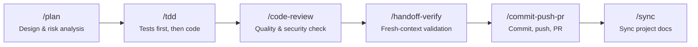

<div align="center">

# dotnet-claude-forge

**Claude Code workflow framework for .NET Clean Architecture**

Specialized configuration, custom agents, and automation scripts
for C# / .NET 10 · Blazor Auto · Supabase · Azure projects

[](LICENSE)
[](https://claude.com/claude-code)
[](https://dotnet.microsoft.com)

> Forked from [sangrokjung/claude-forge](https://github.com/sangrokjung/claude-forge) — rebuilt for .NET.

[한국어](README.ko.md)

</div>

---

## What is dotnet-claude-forge?

**dotnet-claude-forge** is a fork of [claude-forge](https://github.com/sangrokjung/claude-forge) optimized for **.NET 10 / Blazor Auto / Clean Architecture** projects.

It turns Claude Code from a basic CLI into a full .NET development environment. One install gives you 11 specialized agents, 36+ slash commands, .NET-specific verification skills (Blazor / EF Core / Clean Arch), and 14 automation hooks — ready to go.

### Added on top of claude-forge

| Addition | Description |
|:---------|:------------|
| `skills/verify-blazor` | Validate `.razor` component structure, DI, render modes |
| `skills/verify-ef-migration` | EF Core migration safety checks |
| `skills/verify-clean-arch` | Detect Clean Architecture layer dependency violations |
| `rules/architecture-dotnet` | Clean Architecture layers, CQRS, Result pattern |
| `rules/coding-style-dotnet` | Nullable, immutability, Serilog, file size limits |
| `rules/security-dotnet` | JWT + HttpOnly Cookie, CORS, FluentValidation |
| `rules/testing-dotnet` | TDD workflow, xUnit, Testcontainers |
| `rules/database-supabase` | PostgreSQL, EF Core, RLS, migrations |
| `rules/frontend-blazor` | Blazor Auto, JS Interop, memory management |
| `rules/azure-deployment` | App Service, Key Vault, Scale Out considerations |

---

## ⚡ Quick Start

```bash
# 1. Clone
git clone --recurse-submodules https://github.com/daeha76/dotnet-claude-forge.git
cd dotnet-claude-forge

# 2. Install (macOS / Linux)
./install.sh

# 2. Install (Windows PowerShell)
.\install.ps1

# 3. Launch Claude Code
claude
```

> `dotnet-script` is installed automatically if missing.
> On macOS/Linux, symlinks are used so `git pull` updates everything instantly.
> On Windows, files are copied — re-run `install.ps1` after `git pull`.

### New here?

| Step | What to do |
|:-----|:-----------|
| 1 | Run `/guide` after install — an interactive 3-minute tour |
| 2 | Use `/plan` to design your feature before coding |
| 3 | Or just type `/auto login page` and let it handle plan-to-PR |

---

## 🔄 Development Workflows

### Feature Development

```
/plan → /tdd → /code-review → /handoff-verify → /commit-push-pr → /sync
```



| Step | What happens |
|:-----|:-------------|
| `/plan` | AI creates implementation plan. Waits for confirmation before coding. |
| `/tdd` | Write tests first, then code. One unit of work at a time. |
| `/code-review` | Security + quality check on the code you just wrote. |
| `/handoff-verify` | Auto-verify `dotnet build` + `dotnet test` in a fresh context. |
| `/commit-push-pr` | Commit, push, and create PR — all in one. |
| `/sync` | Sync project docs (`CLAUDE.md`, `prompt_plan.md`, `spec.md`). |

### Bug Fix

```
/explore → /tdd → /verify-loop → /quick-commit → /sync
```

### Security Audit

```
/security-review → /stride-analysis-patterns → /security-compliance
```

---

## 📦 What's Inside

| Category | Count | Highlights |
|:--------:|:-----:|:-----------|
| **Agents** | 11 | `planner` `architect` `code-reviewer` `security-reviewer` `tdd-guide` `database-reviewer` + 5 more |
| **Commands** | 36 | `/plan` `/tdd` `/handoff-verify` `/commit-push-pr` `/explore` `/orchestrate` ... |
| **Skills** | 15 | `build-system` `security-pipeline` `team-orchestrator` `session-wrap` `verification-engine` ... |
| **Hooks** | 14 | Secret filtering, DB protection, security auto-trigger, rate limiting ... |
| **Rules** | 8 | `architecture-dotnet` `coding-style-dotnet` `security-dotnet` `testing-dotnet` ... |

---

## 📥 Installation Guide

### Prerequisites

| Dependency | Required | Notes |
|:-----------|:--------:|:------|
| .NET SDK | ✅ | Runs `install.csx` + scaffolds .NET projects |
| Git | ✅ | Clone, submodules |
| Claude Code CLI | ✅ | `claude` command |
| Node.js | ✅ | MCP servers (npx) |
| dotnet-script | auto-installed | C# script engine |

### Create a New .NET Project

```bash
# macOS / Linux
./install.sh MyApp

# Windows
.\install.ps1 MyApp

# With custom path (macOS / Linux)
./install.sh MyApp ~/Desktop

# With custom path (Windows)
.\install.ps1 MyApp D:\\projects
```

Scaffolds a full Clean Architecture solution:

```
MyApp/
  src/
    MyApp.Domain/          # Entities, value objects
    MyApp.Application/     # Use cases, CQRS, interfaces
    MyApp.Infrastructure/  # EF Core, Supabase, external services
    MyApp.Api/             # ASP.NET Core Web API
    MyApp.Web/             # Blazor Auto frontend
    MyApp.AppHost/         # .NET Aspire orchestrator
  tests/
    MyApp.Domain.Tests/
    MyApp.Application.Tests/
    MyApp.Architecture.Tests/   # Layer dependency auto-validation
  .claude/                 # Claude Forge features
  CLAUDE.md                # Project context for Claude
```

### MCP Servers

| Server | API Key | Purpose |
|:-------|:--------|:--------|
| **context7** | None | Real-time library docs |
| **memory** | None | Persistent knowledge graph |
| **github** | `GITHUB_PERSONAL_ACCESS_TOKEN` | Repo / PR / Issues |
| **supabase** | Supabase URL/Key | Direct DB integration |

---

## 🤖 Agents

### Opus Agents (6) — Deep analysis & planning

| Agent | Purpose |
|:------|:--------|
| **planner** | Implementation planning for complex features |
| **architect** | System design, scalability decisions |
| **code-reviewer** | Quality, security, and maintainability review |
| **security-reviewer** | OWASP Top 10, secrets, injection detection |
| **tdd-guide** | TDD enforcement (RED → GREEN → IMPROVE) |
| **database-reviewer** | PostgreSQL/Supabase query optimization, schema design |

### Sonnet Agents (5) — Fast execution & automation

| Agent | Purpose |
|:------|:--------|
| **build-error-resolver** | Fix build / compile errors automatically |
| **e2e-runner** | Generate and run Playwright E2E tests |
| **refactor-cleaner** | Dead code cleanup |
| **doc-updater** | Documentation and codemap updates |
| **verify-agent** | Fresh-context build / test / lint verification |

---

## 📋 All Commands

<details>
<summary><strong>36 Commands (click to expand)</strong></summary>

#### Core Workflow

| Command | Description |
|:--------|:------------|
| `/plan` | AI creates implementation plan. Waits for confirmation before coding. |
| `/tdd` | Write tests first, then code. One unit of work at a time. |
| `/code-review` | Security + quality check on code you just wrote. |
| `/handoff-verify` | Auto-verify build/test/lint all at once. |
| `/commit-push-pr` | Commit, push, create PR — all in one. |
| `/quick-commit` | Fast commit for simple, well-tested changes. |
| `/verify-loop` | Auto-retry build/lint/test up to 3x with auto-fix. |
| `/auto` | One-button automation: plan to PR. |
| `/guide` | Interactive 3-minute tour for first-time users. |

#### Exploration & Analysis

| Command | Description |
|:--------|:------------|
| `/explore` | Navigate and analyze codebase structure. |
| `/build-fix` | Incrementally fix build errors. |
| `/next-task` | Recommend next task based on project state. |
| `/suggest-automation` | Analyze repetitive patterns and suggest automation. |

#### Security

| Command | Description |
|:--------|:------------|
| `/security-review` | CWE Top 25 + STRIDE threat modeling. |
| `/stride-analysis-patterns` | Systematic STRIDE methodology. |
| `/security-compliance` | SOC2, ISO27001, GDPR, HIPAA compliance checks. |

#### Testing

| Command | Description |
|:--------|:------------|
| `/e2e` | Generate and run Playwright end-to-end tests. |
| `/test-coverage` | Analyze coverage gaps and generate missing tests. |

#### Documentation & Sync

| Command | Description |
|:--------|:------------|
| `/update-codemaps` | Analyze codebase and update architecture docs. |
| `/sync-docs` | Sync `prompt_plan.md`, `spec.md`, `CLAUDE.md`. |
| `/sync` | `git pull` + sync all project docs. |
| `/pull` | Quick `git pull origin main`. |

#### Project Management

| Command | Description |
|:--------|:------------|
| `/init-project` | Scaffold new project with standard structure. |
| `/orchestrate` | Agent Teams parallel orchestration. |
| `/checkpoint` | Save/restore work state. |
| `/learn` | Record lessons learned + suggest automation. |

#### Refactoring & Debugging

| Command | Description |
|:--------|:------------|
| `/refactor-clean` | Identify and remove dead code. |
| `/debugging-strategies` | Systematic debugging techniques and profiling. |
| `/dependency-upgrade` | Major dependency upgrades with compatibility analysis. |

#### Git Worktree

| Command | Description |
|:--------|:------------|
| `/worktree-start` | Create git worktree for parallel development. |
| `/worktree-cleanup` | Clean up worktrees after PR completion. |

</details>

---

## 🛡 Automation Hooks

### Security Hooks

| Hook | Trigger | Protects Against |
|:-----|:--------|:-----------------|
| `output-secret-filter.sh` | PostToolUse | Leaked API keys, tokens in output |
| `remote-command-guard.sh` | PreToolUse (Bash) | Unsafe remote commands (curl pipe, wget pipe) |
| `db-guard.sh` | PreToolUse | Destructive SQL (DROP, TRUNCATE, DELETE without WHERE) |
| `security-auto-trigger.sh` | PostToolUse (Edit/Write) | Vulnerabilities in code changes |
| `rate-limiter.sh` | PreToolUse (MCP) | MCP server abuse / excessive calls |

### Utility Hooks

| Hook | Trigger | Purpose |
|:-----|:--------|:--------|
| `code-quality-reminder.sh` | PostToolUse (Edit/Write) | Reminds about immutability, small files, error handling |
| `context-sync-suggest.sh` | SessionStart | Suggests syncing docs at session start |
| `session-wrap-suggest.sh` | Stop | Suggests session wrap-up before ending |
| `task-completed.sh` | TaskCompleted | Notifies on subagent task completion |

---

## Skill Compatibility (.NET)

### ✅ Fully Supported

| Skill | Notes |
|:------|:------|
| `build-system` | Auto-detects `.csproj`/`.slnx`, runs `dotnet build/test` |
| `verification-engine` | References commands from `CLAUDE.md` automatically |
| `security-pipeline` | Language-agnostic, file-pattern-based security scan |
| `session-wrap` | Language-agnostic |
| `team-orchestrator` | Language-agnostic |

### ⚠️ Limited

| Skill | Limitation |
|:------|:-----------|
| `frontend-code-review` | `.tsx/.ts` checklist only — use `verify-blazor` for `.razor/.cs` |

### 📝 .NET-Specific Skills (included in `skills/`)

| Skill | Purpose |
|:------|:--------|
| `verify-blazor` | Validate Blazor component patterns, `@inject`/`@code`/`@rendermode` |
| `verify-ef-migration` | EF Core migration naming, rollback, destructive change safety |
| `verify-clean-arch` | Detect Clean Architecture layer dependency violations |

---

## Build & Verify Commands

```bash
# Build
dotnet build

# Test
dotnet test

# Format check
dotnet format --verify-no-changes

# EF Core migrations
dotnet ef migrations add [Name] --project src/Infrastructure --startup-project src/Api
dotnet ef database update --project src/Infrastructure --startup-project src/Api
```

---

## Contributing

See [CONTRIBUTING.md](CONTRIBUTING.md) for guidelines on adding agents, commands, skills, and hooks.

---

## License

[MIT](LICENSE) — use it, fork it, build on it.

---

<div align="center">

Forked from [sangrokjung/claude-forge](https://github.com/sangrokjung/claude-forge) — rebuilt for .NET

</div>
